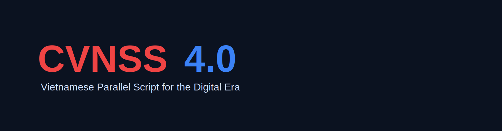

<p align="center">
  <a href="https://cvnss.github.io/cvnss-guide/">
    
  </a>
</p>

<p align="center">
  <a href="https://cvnss.github.io/cvnss-guide/">
    
  </a>
  <a href="https://cvnss.github.io/cvnss-guide/docs/spec.html">
    
  </a>
  <a href="https://github.com/CVNSS/cvnss-guide/releases">
    
  </a>
  <a href="https://github.com/CVNSS/cvnss-guide/blob/main/LICENSE">
    
  </a>
</p>

<p align="center">
  <a href="https://cvnss.github.io/cvnss-guide/">
    
  </a>
  
  
  
</p>

---

## 🌐 Languages

🇻🇳 Tiếng Việt
🇬🇧 English
🇨🇳 中文
🇯🇵 日本語
🇰🇷 한국어
🇰🇭 ភាសាខ្មែរ
🇷🇺 Русский

---

# 🚀 Vision

**CVNSS4.0** is a **parallel Vietnamese writing system** designed for the digital era.

It enables:

* Fast typing
* ASCII-safe transmission
* Cross-platform stability
* Reversible tone encoding
* AI/NLP compatibility

> CVNSS4.0 does **not replace Vietnamese orthography**.
> It works as a **parallel machine-friendly representation layer**.

---

# ⚙️ Core Principles

### 1. ASCII-only design

Uses only:

```
A–Z (26 Latin letters), base26
```

No diacritics. No Unicode dependency.

---

### 2. Tone encoding via suffix (KHD)

Instead of visual tone marks:

| Vietnamese | CVNSS4.0 |
| ---------- | -------- |
| tuyết      | tydb     |
| nguyễn     | wylg     |
| chào       | chaol     |
| tiếng      | tizb  |

---

### 3. Reversible transformation

```
Vietnamese ↔ CVNSS4.0
```

No information loss.

---

# 🧠 Why CVNSS4.0?

## For Humans

* Faster typing
* No special keyboard needed
* Works in restricted environments

## For Machines

* ASCII-safe logs and identifiers
* Easier NLP tokenization
* Stable encoding across platforms
* Better interoperability

---

# 🏗 System Architecture

```
Vietnamese (Unicode)
        ↓
Unicode Normalize (NFC)
        ↓
Syllable Parse (O-R-T-D)
        ↓
CVN Compression
        ↓
KHD Tone Encoding
        ↓
Disambiguation (P)
        ↓
CVNSS4.0 Output (ASCII)
```

---

# 🔬 Research Overview (IEEE-style)

## Abstract

CVNSS4.0 is a Vietnamese shorthand and transliteration system using only the 26 Latin letters.
It encodes tonal and diacritic information through systematic suffix rules, producing an ASCII-safe representation suitable for digital communication, AI processing, and cross-platform environments.

## Keywords

Vietnamese writing systems, transliteration, shorthand, ASCII encoding, NLP, human–computer interaction

---

## Problem

Vietnamese writing relies heavily on diacritics, which:

* Cause encoding inconsistencies
* Increase typing complexity
* Break in ASCII-only systems
* Complicate NLP pipelines

---

## Solution

A reversible ASCII-based parallel script:

```
CVNSS4.0 = CVN compression + KHD tone encoding + disambiguation
```

---

## Key Properties

| Property         | CVNSS4.0 |
| ---------------- | -------- |
| ASCII-safe       | Yes      |
| Reversible       | Yes      |
| Tone preserved   | Yes      |
| Machine-friendly | Yes      |
| Human-readable   | Yes      |

---

# 🌐 Use Cases

### Digital Communication

* Chat systems
* International forms
* Embedded devices

### Software Engineering

* Log files
* Identifiers
* File paths

### AI / NLP

* Tokenization
* Speech-text alignment
* Language models

### Input Systems

* Keyboard engines
* Mobile typing
* IME development

---

# 📚 Official References

**Official project site:**
https://chuvnsongsong.com/

**Archive repository:**
https://chuvietnhanh.sourceforge.net/

**Formula / Rules:**
https://chuvietnhanh.sourceforge.net/TomGonCongThucCVNSS.htm

**Research paper:**
https://vietnamhoc.net/chu-vn-song-song-cvnss4-0-trong-boi-canh-cach-mang-cong-nghe-4-0/

---

# 👥 Project Credits

**License:** MIT

**Founders**

* Trần Tư Bình
* Kiều Trường Lâm

**Maintainer**

* Lê Hoàng Hà (hoaflee)

**Core contributors**

* Hoàng Văn Bát
* Trần Thị Minh
* Nguyễn Thị Thái
* Nguyễn Văn Luận
* Phạm Hợi
* Nguyễn Văn Chung
* Phạm Thị Là 
* Lê Xuân Hẳn 
* Chu Cẩm Tú Linh
* Trần Huệ Chánh
* Nguyễn Thiện Toàn
* ...

**Developer (this tool)**

* Long Ngo

---

# 📄 License

MIT License
See the `LICENSE` file for details.

---

# 🧭 Roadmap

* [2020-2025]. CVNSS4.0 Core Specification (IETF-style)
* [2026-2027]. Multi-agent language protocol integration
* [2026-2027]. Official IME implementations
* [2026-2028]. NLP datasets and benchmarks
* [2027-2030]. International standardization

---

<p align="center">
  <b>
    <span style="color:#d00000;">CVNSS</span>
    <span style="color:#1d4ed8;">4.0</span>
  </b><br>
  Parallel Vietnamese Script for the Age of AI
</p>
